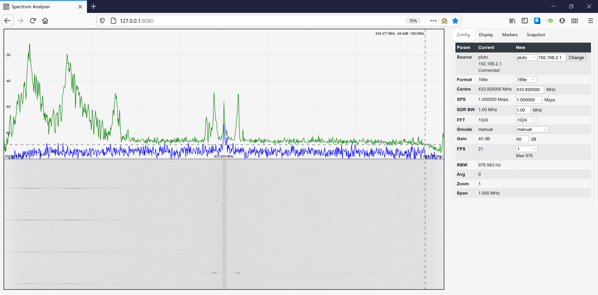

# A Python/webUI RF spectrum analyser

Support for rtlsdr, pluto, funcube, sdrplay (soapy), audio, socket, file.

* Python processing.
* Web javascript UI.
* Spectrums are done at the sample rate.
* Useful for detecting short bursting signals.
* Plugin architecture for sources and analysis of spectrums.
* Snapshot file upon an event, currently a manual trigger.
* Has a web based UI that can be used to take measurements on the spectrum.
* Processing runs with no web client attached.

This was an exercise in writing some python which expanded into providing a web based UI. The fft computations are done
by libraries in Python, so not the fastest.

If you have some sort of sdr working with other tools then after installing the required python dependencies it should
just work.

Performance depends on your machine and how the supporting fft libraries were compiled. I have certainly kept up with
streams of data at over 3Msps.

## Input modules:

* audio - Useful for testing
* file - wav and raw binary supported, all files must be in the snapshot directory
* pluto (IP)  - Analog devices pluto SDR, 70MHz to 6GHz with wide open front end
* rtlsdr - USB source
* rtltcp - rtl over tcp
* socket - A stream of IQ samples
* funcube - Pro and pro+ as audio devices, hid control supported in Linux only
* soapy - Support for sdrplay under Linux

## Input data IQ types:

* 8bit offset binary
* 8bit 2's complement
* 16bit 2's complement little endian (x86)
* 16bit 2's complement big endian
* 32bit ieee float little endian
* 32bit ieee float big endian

## Problems

* If the programme exceptions immediately, check the dependencies.
* funcube will exception under windows when closed, which we do when changing the source

## Installation - windows

Should be similar to the linux install, but

* No support for hid control of funcube, we can stream samples but not control the device.
* No support for sdrplay, as we don't have SoapySDR support - don't know how to install on windows.

## Installation - linux

    cd ~
    git clone https://github.com/naj1024/pyspectrum.git

Edit requirements.txt for required input sources.

    vi ./pyspectrum/src/requirements.txt

I'm using pipenv for a virtual environment.

    pipenv shell
    pip install -r ./pyspectrum/src/requirements.txt

Run, then connect to localhost:8080 in a browser

    python3 ./pyspectrum/src/SpectrumAnalyser.py

# Soapy support - linux

The easiest way to get SoapySDR support is to install it from your distributions repository

    apt install python3-soapysdr
    dpkg -L dpkg -L python3-soapysdr

then copy to your virtual environment, say it is called sid-xxxx

    cp /usr/lib/python3/dist-packages/SoapySDR.py ~/.local/share/virtualenvs/sid-xxxx/lib/python3.9/site-packages/
    cp /usr/lib/python3/dist-packages/_SoapySDR.cpython-39-x86_64-linux-gnu.so ~/.local/share/virtualenvs/sid-xxxx/lib/python3.9/site-packages/

## TODO

* hackrf input would be nice to try, don't have one :(
* Detect and record automatically

## Tested with the following:

    Windows: audio, file, pluto, rtlsdr, rtltcp, socket, funcube
    Linux  : audio, file, pluto, rtlsdr, rtltcp, socket, funcube
             soapy(audio, rtlsdr, sdrplay)
    
    On windows make sure you have the correct rlibrtlsdr.dll for your python 32bit/64bit

## Examples

Some examples for running from command line

    python ./SpectrumAnalyser.py         - Then goto http://127.0.0.1:8080 and configure the source

    python ./SpectrumAnalyser.py -h      - help

    python ./SpectrumAnalyser.py -i?     - list input sources that are available

Some default input selections, you normally select through web interface:

      python ./SpectrumAnalyser.py -ipluto:192.168.2.1 -c433.92e6 -s600e3   - pluto at 433MHz and 600ksps
  
      python ./SpectrumAnalyser.py -ipluto:192.168.2.1 -c433.92e6 -s1e6 
                              --plugin analysis:peak:threshold:12 
                              --plugin report:mqtt:broker:192.168.0.101     - detect and log signals
  
      python ./SpectrumAnalyser.py -ifile:test.wav -c433.92e6    - a test wav file
  
      python ./SpectrumAnalyser.py -iaudio:1 -s48e3 -iaudio:1    - audio input 
  
      python ./SpectrumAnalyser.py -irtlsdr:kk -c433.92e6 -s1e6   - rtlsdr

    SOAPY:
      python ./src/SpectrumAnalyser.py -isoapy:audio -s48000 -c0  - soapy input
      python ./src/SpectrumAnalyser.py -isoapy:sdrplay -s2e6 c433.92e6 

## Dependencies

The following python modules should be installed. Optional ones provide specific capabilities.

    Required:
        numpy
        websockets
        matplotlib
        
    Testing:
        pytest
        
    Optional:
        scipy       - another FFT library
        pyfftw      - another FFT library, faster above 8k size (for me)
        pyadi-iio   - pluto device
        iio         - pluto device
        pyrtlsdr    - rtlsdr devices
        sounddevice - audio and funcube devices
        soapysdr    - soapy support
        paho-mqtt   - mqtt plugin (client)
        hid         - funcube control through usb hid, linux only?

## AD936x pluto XO support

We can add support for pluto frequency correction in ppm by adding the following to the file ad936x.py when pyadi-iio is
installed. You should find the ad936x.py file under the adi directory in the site packages traversed by your
environment. Insert the lines in the ad9364 class definitions.

    @property
    def xo_correction(self):
        return self._get_iio_dev_attr("xo_correction")

    @xo_correction.setter
    def xo_correction(self, value):
        self._set_iio_dev_attr_str("xo_correction", value)